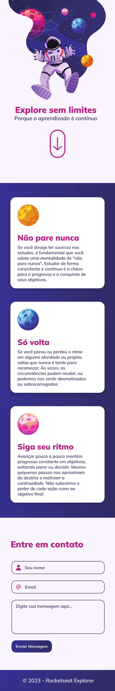
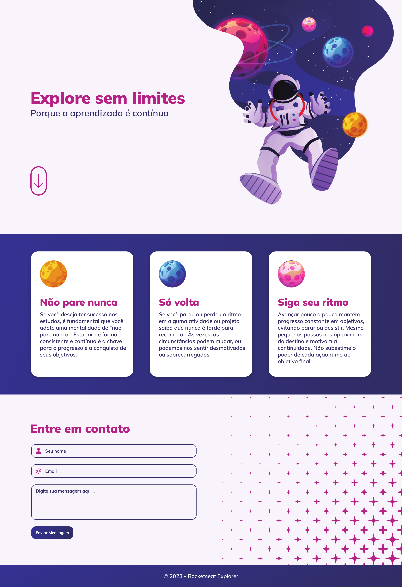

# Explore sem limites

## Description

Um projeto feito com o intuíto de treinar a responsividade e a semanântica de uma página web, tomando muito cuidado também com a acessibilidade para que todas as pessoas possam acessar o site de forma igual.

O formulário presente na página web não tem envio algum ainda, pois o intuito seria a parte gráfica e responsividade do site.

## Screenshots

## 🔗 Links

## Tech Stack

**Client:** Css, Html

**Server:** Local Host

